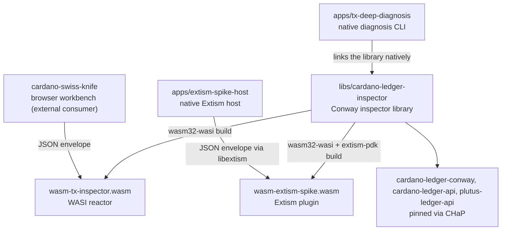

# cardano-ledger-inspector

Cardano ledger operations packaged as a WASI reactor, an Extism conformance
plugin, an OpenAPI contract, a protocol registry, and a native diagnosis CLI.
The browser product that consumes this engine lives in
[`cardano-swiss-knife`](https://lambdasistemi.github.io/cardano-swiss-knife/).

## What Is This

One Haskell library, `libs/cardano-ledger-inspector/`, is the canonical
target-independent wrapper for nine Conway ledger operations —
`tx.inspect`, `tx.browse`, `tx.identify`,
`tx.intent`, `tx.review`, `tx.witness.plan`, `tx.witness.attach`, `tx.validate`,
and `tx.evaluate.scripts` — behind a single JSON dispatcher
(`Conway.Inspector.runLedgerOperationInput`). Operations receive a JSON
control envelope carrying the transaction as CBOR hex. The wrapper delegates
base semantics to the pinned `cardano-ledger-wasm` kernel, which runs real
`cardano-ledger-conway` code (including `applyTx` and phase-2 script
evaluation), then owns the typed metadata and embedded protocol-registry
`tx.intent` enrichments.

The library is compiled three ways from the same source: to a `wasm32-wasi`
reactor (`wasm-tx-inspector.wasm`) consumed by the cardano-swiss-knife
workbench and runnable under `wasmtime`; to a wasm Extism plugin
(`wasm-extism-spike.wasm`) used as a conformance reference for alternative
node implementations; and natively, linked into the `tx-deep-diagnosis`
CLI, which adds Blockfrost producer-transaction resolution and protocol
registry labelling on top.

This repository was split out of
[`lambdasistemi/cardano-node-clients`](https://github.com/lambdasistemi/cardano-node-clients)
so the WASI ledger operation layer can evolve independently from the
node-client library.

## Architecture



- `libs/cardano-ledger-inspector/` — canonical Haskell wrapper owning the
  target-independent operation boundary and `tx.intent` enrichments. Its WASI
  shell compiles to `wasm-tx-inspector.wasm`; the same library is linked by the
  native CLI and Extism plugin below.
- `apps/tx-deep-diagnosis/` — native CLI that links the inspector library
  directly, resolves producer transactions via Blockfrost, and labels script
  hashes against the protocol registry to produce a layered diagnosis report.
  The default registry (under `docs/inspector/protocols/`) is bundled into
  the binary at build time, so `nix run` works from anywhere with no
  checkout. Pass `--registry DIR` (repeatable) to layer your own protocol
  identifications on top.
- `apps/wasm-extism-spike/` — wasm Extism plugin exposing the inspector's
  operations, including `tx_intent`, as named exports for
  cross-implementation conformance testing.
- `apps/extism-spike-host/` — native Extism host that loads the wasm spike
  via libextism for CI-side conformance checks.
- `docs/inspector/protocols/` — protocol registry source consumed by the
  native CLI and exposed as the `protocol-registry` flake package.
- `nix/wasm/` — reusable Nix machinery for compiling selected Cardano ledger
  Haskell packages to `wasm32-wasi`.
- `specs/001-ledger-functional-layer/contracts/ledger-functional-api.md` —
  current JSON-control / CBOR-data operation contract.

## Install

Tagged releases are produced by
[release-please](https://github.com/googleapis/release-please) from
conventional-commit history. Each release attaches:

- `cardano-ledger-reference-<tag>.wasm` — Extism plugin exposing
  `tx_identify`, `tx_intent`, `tx_validate`, and `tx_evaluate_scripts`. The
  conformance reference for alternative node implementations: load this in
  your test runner via any
  [Extism host SDK](https://extism.org/docs/concepts/host-sdk), call the same
  exports against the same input, diff your output. The
  Wasmtime-backed SDKs (Rust, Haskell, Python via libextism, etc.)
  work; the Go SDK currently does not because its bundled wazero
  predates wasm tail-call support.
- `wasm-tx-inspector-<tag>.wasm` — same Conway ledger, packaged as a
  WASI reactor (stdin/stdout JSON). Suitable for shell-driven debug
  and external hosts such as cardano-swiss-knife.
- `ledger-functional-openapi-<tag>.tar.gz` — OpenAPI contract for the
  JSON envelope.
- `SHA256SUMS-<tag>.txt` — checksums.

Releases: <https://github.com/lambdasistemi/cardano-ledger-inspector/releases>

You can also build any artifact directly from GitHub:

```bash
nix build github:lambdasistemi/cardano-ledger-inspector#packages.x86_64-linux.wasm-tx-inspector
nix build github:lambdasistemi/cardano-ledger-inspector#packages.x86_64-linux.protocol-registry
```

Every `CI` workflow run additionally uploads per-run
`wasm-tx-inspector` and `ledger-functional-openapi` artifacts, each with
`SHA256SUMS`, retained for 30 days. Use these for inspecting a specific PR;
use a tagged release for anything you depend on. Download them from the
**Artifacts** section of a run under
<https://github.com/lambdasistemi/cardano-ledger-inspector/actions/workflows/ci.yml>.

## Quickstart

Run a ledger operation against a committed mainnet fixture, no provider
keys needed:

```bash
nix build .#packages.x86_64-linux.wasm-tx-inspector -o result-wasm
nix develop --quiet -c sh -c \
  'wasmtime result-wasm/wasm-tx-inspector.wasm \
     < specs/001-ledger-functional-layer/fixtures/conway-mainnet-tx.hex'
```

Raw transaction hex on stdin runs the legacy inspection path. Named
operations use the JSON envelope:

```bash
nix develop --quiet -c sh -c '
  jq -n --rawfile tx specs/001-ledger-functional-layer/fixtures/conway-mainnet-tx.hex \
    "{ledger_functional_layer: \"cardano-ledger-functional/v1\",
      tx_cbor: (\$tx | gsub(\"\\\\s\"; \"\")), op: \"tx.identify\", args: {}}" \
  | wasmtime result-wasm/wasm-tx-inspector.wasm'
```

## Usage

| Operation | Description |
| --- | --- |
| `tx.inspect` | Decode transaction CBOR and return a compact summary plus the root structured view. |
| `tx.browse` | Return a navigable representation of the transaction at `args.path`. |
| `tx.identify` | Return transaction id, body hash, era, byte size, fee, structural counts, and witness counts. |
| `tx.intent` | Return a signer-focused summary: visible effects, self-declared metadata claims, required signers, scripts, withdrawals, mint/burn, collateral, and context coverage. |
| `tx.review` | Project the enriched `tx.intent` result into a signer-facing review: output control groups, value sources, high-value movements, fee, conditional collateral, net-signer-value status, and isolated self-declared claims. |
| `tx.witness.plan` | Return signer, witness, script, redeemer, datum, reference-input, and producer-transaction context coverage data. |
| `tx.witness.attach` | Attach or replace one vkey witness and return patched transaction CBOR plus stable diagnostics. |
| `tx.validate` | Build a Conway ledger environment from explicit context, run `applyTx` when context is complete, and report ledger failures. |
| `tx.evaluate.scripts` | Run phase-2 script evaluation when context is complete and report per-redeemer execution units or failures. |

Hosts and entry points:

- **Browser workbench** —
  <https://lambdasistemi.github.io/cardano-swiss-knife/>. Its inspector
  consumes this repository's `wasm-tx-inspector` and `protocol-registry`
  outputs and owns browser state and provider integration.
- **Native CLI** — `nix run .#tx-deep-diagnosis -- --cbor tx.hex --format explain`
  produces a layered markdown diagnosis;
  see the [CLI walkthrough](https://lambdasistemi.github.io/cardano-ledger-inspector/build/)
  for registries, Blockfrost resolution, and `--emit-explain` artifacts.
- **Extism host** —
  `extism-spike-host PATH-TO-WASM [FUNCTION] < envelope.json > response.json`
  calls the plugin's `tx_identify`, `tx_intent`, `tx_validate`, or
  `tx_evaluate_scripts` exports.

## Documentation

- Repository docs: <https://lambdasistemi.github.io/cardano-ledger-inspector/>
- Functional API definition: <https://lambdasistemi.github.io/cardano-ledger-inspector/api/>
- Swagger UI: <https://lambdasistemi.github.io/cardano-ledger-inspector/swagger/>
- Browser workbench: <https://lambdasistemi.github.io/cardano-swiss-knife/>
- Former inspector route (redirect):
  <https://lambdasistemi.github.io/cardano-ledger-inspector/inspector/>

For AI agents, start at [AGENTS.md](AGENTS.md).

## Development

```bash
just --list
nix develop --quiet -c just ci
just build-wasm
just check-openapi
just check-swagger
just check-identify
just check-rdf
just check-witness-plan
just check-witness-attach
just check-intent
just check-input-context
just check-validate
just check-evaluate-scripts
just check-extism-spike
just build-pages-site
just test
```

Run `nix develop --quiet -c just ci` before pushing. It mirrors the GitHub
Actions build gate and its required follow-on checks.

The first full WASI ledger build can take a long time because Cabal populates a
fresh dependency cache. Haskell-only edits inside the tx inspector use the
split `prebuiltDeps` path and rebuild much faster after the cache exists.
`just check-openapi` and `just check-swagger` regenerate the OpenAPI document
through Nix and fail if it differs from the committed Swagger JSON.
`just check-identify` runs the WASI executable against a committed Conway
transaction fixture and verifies the `tx.identify` response shape.
`just check-intent` verifies signer-perspective value accounting against a
complete producer-context fixture.
`just check-witness-plan` verifies the implemented `tx.witness.plan` response
shape against the same fixture.
`just check-witness-attach` verifies inserted vs replaced witness behavior and
rejected missing-witness diagnostics.
`just check-input-context` verifies that explicit `args.context.producer_txs`
entries are decoded by Haskell and reported as complete witness-plan input
context.
`just check-validate` verifies the implemented `tx.validate` response shape,
including incomplete-context diagnostics and producer transaction coverage.
The positive validation fixture is
`specs/001-ledger-functional-layer/fixtures/tx-validate-complete-request.json`.
`just check-evaluate-scripts` verifies the implemented `tx.evaluate.scripts`
response shape, including incomplete-context diagnostics, per-redeemer budget
data, and complete-context execution-unit reporting.
`just check-review` verifies the implemented `tx.review` projection: a
complete-context request with a provable signer net, the issue fixture's
output control groups, fee, conditional collateral, high-value movements,
isolated metadata claims, and the explicit unprovable-net note, plus
byte-identical registered and unknown-registry responses across WASI, native,
and Extism.
`just check-extism-spike` verifies Extism responses against the WASI reactor
byte-for-byte. For registered and unknown-script `tx.intent` envelopes it also
compares the private native wrapper runner, proving identical typed metadata,
registered datum/redeemer/deployment enrichment, and raw fallback across all
three targets. `just test` runs the complete engine CI recipe.

## License

MIT — see [LICENSE](LICENSE).
