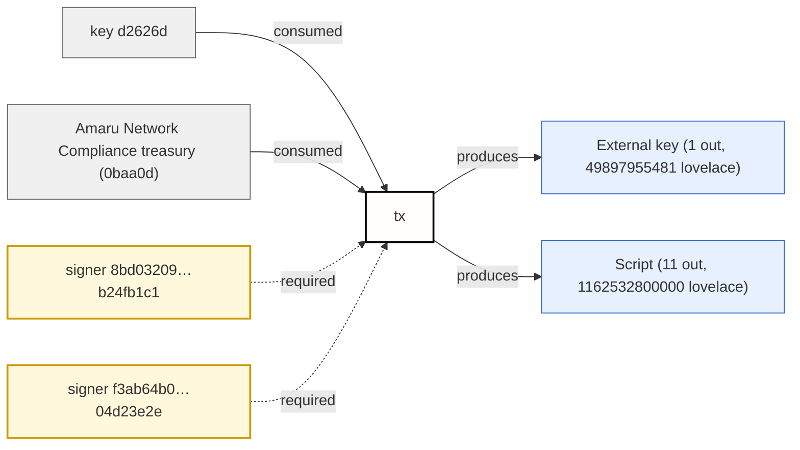
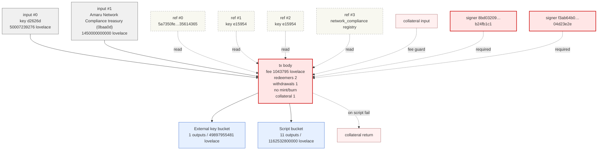
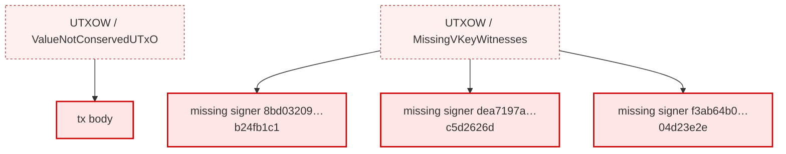

# Signing summary

_1 metadata claim / 2 missing required signers / 2 redeemers_

Tx id: `30723408902f540c29e2e0ec7cb0dc89a0024d00506b564e326b8fe10fd2a00f`

## Verdict

- 6/6 producer txs resolved, network=mainnet
- ledger validation: **invalid**

## Claims

| Label | Value | Detail |
|-------|-------|--------|
| Swap ADA<->USDM | Swapping ADA for $100k at a rate of $0.245 per ADA | Required to pay Antithesis as vendor / destination Network Compliance's treasury / metadata label 1694 / self-declared |

## Signer value perspective

| Label | Value | Detail |
|-------|-------|--------|
| Net signer ADA | unknown | producer transaction CBOR must resolve every regular input before signer net can be known |
| Signer-controlled inputs | unknown | 0 resolved source outputs matched signer payment key hashes out of 0 resolved inputs |
| Signer-controlled outputs | 0 ADA | 0 outputs matched signer payment key hashes out of 12 outputs |
| External/script outputs | 1212430.755481 ADA | outputs not controlled by declared or witnessed signer payment key hashes |

## Critical effects

| Label | Value | Detail |
|-------|-------|--------|
| Consumes inputs | 2 inputs | source outputs not supplied |
| Creates outputs | 12 outputs | 1212430755481 lovelace total across all outputs |
| Pays fee | 1043795 lovelace |  |
| Required signatures | 2 signers | 2 declared signers missing from witnesses |
| Scripts | 2 redeemers | 0 script witnesses |
| Reference inputs | 4 read-only inputs | reference inputs are available to scripts but are not spent |
| Withdrawals | 1 withdrawal |  |
| Mint/burn | No mint/burn |  |
| Collateral | 1 collateral input | total 1565693 lovelace / return 50005673583 lovelace |

## Missing required signers

| Label | Value | Detail |
|-------|-------|--------|
| declared required signer not present in vkey or bootstrap witnesses | 8bd03209d227956aaf9670751e0aa2057b51c1537a43f155b24fb1c1 | declared required signer not present in vkey or bootstrap witnesses |
| declared required signer not present in vkey or bootstrap witnesses | f3ab64b0f97dcf0f91232754603283df5d75a1201337432c04d23e2e | declared required signer not present in vkey or bootstrap witnesses |

## Validation failures

| Rule | Message |
|------|---------|
| UTXOW | Transaction witness or UTxO validation failed: UtxoFailure (ValueNotConservedUTxO Mismatch (RelEQ) {supplied: MaryValue (Coin 1500007239276) (MultiAsset (fromList [])), expected: MaryValue (Coin 1212431799276) (MultiAsset (fromList []))}) |
| UTXOW | Transaction witness or UTxO validation failed: MissingVKeyWitnessesUTXOW (NonEmptySet (fromList [KeyHash {unKeyHash = "8bd03209d227956aaf9670751e0aa2057b51c1537a43f155b24fb1c1"},KeyHash {unKeyHash = "dea7197ac235d73e7f7b1a249bace6a833722415d88e91dec5d2626d"},KeyHash {unKeyHash = "f3ab64b0f97dcf0f91232754603283df5d75a1201337432c04d23e2e"}])) |

## Warnings

- Metadata describes intent but is self-declared; verify it against the destination addresses and contract policy.
- Declared required signer hashes are absent from the witness set.

## Parties

## Balance

### Inputs

| Source | ADA |
|--------|----:|
| input #0 — key d2626d | 50,007.239276 |
| input #1 — Amaru Network Compliance treasury (0baa0d) | 1,450,000.000000 |
| **Total inputs** | **1,500,007.239276** |

### Outputs + fee

| Destination | ADA |
|-------------|----:|
| External key bucket | 49,897.955481 |
| Script bucket | 1,162,532.800000 |
| fee | 1.043795 |
| **Total outputs + fee** | **1,212,431.799276** |

**Unaccounted: 287,575.440000 missing — `ValueNotConservedUTxO`**

## Topology

## Failure overlay

