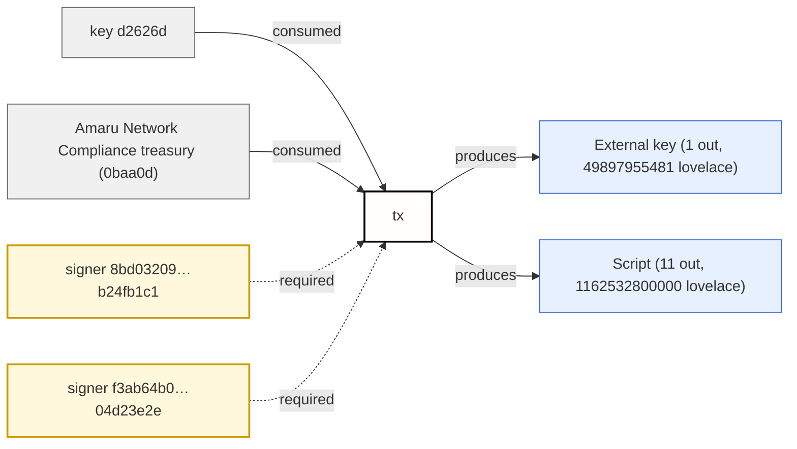
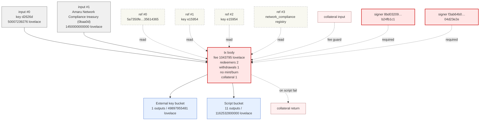
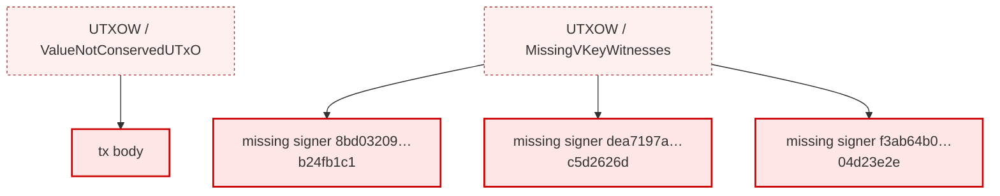

# Signing summary

_1 metadata claim / 2 missing required signers / 2 redeemers_

Tx id: `30723408902f540c29e2e0ec7cb0dc89a0024d00506b564e326b8fe10fd2a00f`

**Headline:** Claimed **Swap ADA<->USDM** is **invalid** and sends most value to the **Script** bucket.

## Verdict

- 6/6 producer txs resolved, network=mainnet
- ledger validation: **invalid**

## Validation failures

### Inputs and outputs do not conserve value: 287,575.440000 ADA missing

_Raw rule:_ `UTXOW — ValueNotConservedUTxO`

- supplied (inputs): **1,500,007.239276 ADA**
- expected (outputs + fee): **1,212,431.799276 ADA**
- Inputs supply **287,575.440000 ADA** more than outputs + fee — that ADA is unaccounted for.

### 3 required signer witnesses are missing

_Raw rule:_ `UTXOW — MissingVKeyWitnessesUTXOW`

The following payment-key hashes are listed as required signers but are missing from the witness set:

- `8bd03209d227956aaf9670751e0aa2057b51c1537a43f155b24fb1c1`
- `dea7197ac235d73e7f7b1a249bace6a833722415d88e91dec5d2626d`
- `f3ab64b0f97dcf0f91232754603283df5d75a1201337432c04d23e2e`

_Tip:_ each hash above is the `payment_key_hash` of one of the resolved inputs (or an explicitly declared required signer in the tx body). Compare with the `Observations` section above to see which party each hash belongs to.

## Balance

### Inputs

| Source | ADA |
|--------|----:|
| input #0 — key d2626d | 50,007.239276 |
| input #1 — Amaru Network Compliance treasury (0baa0d) | 1,450,000.000000 |
| **Total inputs** | **1,500,007.239276** |

### Outputs + fee

| Destination | ADA |
|-------------|----:|
| External key bucket | 49,897.955481 |
| Script bucket | 1,162,532.800000 |
| fee | 1.043795 |
| **Total outputs + fee** | **1,212,431.799276** |

**Unaccounted: 287,575.440000 missing — `ValueNotConservedUTxO`**

## Fees & resources

| Label | Value | Detail |
|-------|-------|--------|
| Fee | 1.043795 ADA | 1043795 lovelace |
| Redeemers | 2 | committed redeemers in the current intent view |
| Committed ex-units | 815,780 memory / 308,746,487 steps | summed from per-redeemer committed budgets |

## Observations

Input parties (registry-resolved):

- input #0 — **key d2626d** (`TruncatedHex`) — 50007239276 lovelace
- input #1 — **Amaru Network Compliance treasury (0baa0d)** (`FromInstance`) — 1450000000000 lovelace

Output parties (registry-resolved, from `intent.value.output_buckets[].addresses`):

- External key bucket → **key d2626d** (`TruncatedHex`)
- Script bucket → **Amaru Network Compliance treasury (0baa0d)** (`FromInstance`)
- Script bucket → **SundaeSwap V3 order** (`FromValidator`)

Metadata-declared destination(s):

- _Network Compliance's treasury_ (self-declared, not verified)

Inputs that also receive outputs (same payment credential on both sides):

- input #1 — **Amaru Network Compliance treasury (0baa0d)** also appears as a destination in the **Script** output bucket

## Claims

| Label | Value | Detail |
|-------|-------|--------|
| Swap ADA<->USDM | Swapping ADA for $100k at a rate of $0.245 per ADA | self-declared, not verified / Required to pay Antithesis as vendor / destination Network Compliance's treasury / metadata label 1694 |

## Signer value perspective

| Label | Value | Detail |
|-------|-------|--------|
| Net signer ADA | unknown | producer transaction CBOR must resolve every regular input before signer net can be known |
| Signer-controlled inputs | unknown | 0 resolved source outputs matched signer payment key hashes out of 0 resolved inputs |
| Signer-controlled outputs | 0 ADA | 0 outputs matched signer payment key hashes out of 12 outputs |
| External/script outputs | 1212430.755481 ADA | outputs not controlled by declared or witnessed signer payment key hashes |

## Critical effects

| Label | Value | Detail |
|-------|-------|--------|
| Consumes inputs | 2 inputs | source outputs not supplied |
| Creates outputs | 12 outputs | 1212430755481 lovelace total across all outputs |
| Pays fee | 1043795 lovelace |  |
| Required signatures | 2 signers | 2 declared signers missing from witnesses |
| Scripts | 2 redeemers | 0 script witnesses |
| Reference inputs | 4 read-only inputs | reference inputs are available to scripts but are not spent |
| Withdrawals | 1 withdrawal |  |
| Mint/burn | No mint/burn |  |
| Collateral | 1 collateral input | total 1565693 lovelace / return 50005673583 lovelace |

## Missing required signers

| Label | Value | Detail |
|-------|-------|--------|
| declared required signer not present in vkey or bootstrap witnesses | 8bd03209d227956aaf9670751e0aa2057b51c1537a43f155b24fb1c1 | declared required signer not present in vkey or bootstrap witnesses |
| declared required signer not present in vkey or bootstrap witnesses | f3ab64b0f97dcf0f91232754603283df5d75a1201337432c04d23e2e | declared required signer not present in vkey or bootstrap witnesses |

## Smart-contract calls

| # | Purpose | Target | ex_units (mem / steps) | Redeemer |
|---|---------|--------|------------------------|----------|
| 0 | spending | input 64f27254f3c0311f…#0 | 609151 / 242364094 | `d87c9fa140a140…` (17B) |
| 1 | rewarding | withdrawal #0 script a64d1b9e1aeffe54056034d84977061b45a92691efc282fbee3fc094 (0.000000 ADA) | 206629 / 66382393 | `80…` (1B) |

## Withdrawals

| # | Reward account | Amount |
|---|----------------|-------:|
| 0 | mainnet / script a64d1b9e1aeffe54056034d84977061b45a92691efc282fbee3fc094 / `f1a64d1b9e1aeffe5405…` | 0.000000 |

## Outputs

| # | Bucket | Destination | ADA | Datum |
|---|--------|-------------|----:|-------|
| 0 | script | Amaru Network Compliance treasury (0baa0d) | 1,041,836.734694 | inline `d8799fd8799f58…` (338B) |
| 1 | script | SundaeSwap V3 order | 12,503.280000 | inline `d8799fd8799f58…` (338B) |
| 2 | script | SundaeSwap V3 order | 12,503.280000 | inline `d8799fd8799f58…` (338B) |
| 3 | script | SundaeSwap V3 order | 12,503.280000 | inline `d8799fd8799f58…` (338B) |
| 4 | script | SundaeSwap V3 order | 12,503.280000 | inline `d8799fd8799f58…` (338B) |
| 5 | script | SundaeSwap V3 order | 12,503.280000 | inline `d8799fd8799f58…` (338B) |
| 6 | script | SundaeSwap V3 order | 12,503.280000 | inline `d8799fd8799f58…` (338B) |
| 7 | script | SundaeSwap V3 order | 12,503.280000 | inline `d8799fd8799f58…` (338B) |
| 8 | script | SundaeSwap V3 order | 12,503.280000 | inline `d8799fd8799f58…` (338B) |
| 9 | script | SundaeSwap V3 order | 12,503.280000 | inline `d8799fd8799f58…` (338B) |
| 10 | script | SundaeSwap V3 order | 8,166.545306 | — |
| 11 | external_key | key d2626d | 49,897.955481 | — |

## Datums

<details><summary>Outputs #0, #1, #2, #3, #4, #5, #6, #7, #8 — SundaeSwap V3 order (9 identical)</summary>

```
Constr 0
  Constr 0
    Bytes 28B 64f35d26b237ad58…6e2540ef
  Constr 1
    List 4
      Constr 0
        Bytes 28B 7095faf3d48d582f…2bbdeffb
      Constr 0
        Bytes 28B f3ab64b0f97dcf0f…04d23e2e
      Constr 0
        Bytes 28B 8bd03209d227956a…b24fb1c1
      Constr 0
        Bytes 28B 97e0f6d6c86dbebf…edd49df2
  Int 1280000
  Constr 0
    Constr 0
      Constr 1
        Bytes 28B 32201dc1e8270836…a10baa0d
      Constr 0
        Constr 0
          Constr 1
            Bytes 28B 32201dc1e8270836…a10baa0d
    Constr 0
  Constr 1
    List 3
      Bytes 0B 
      Bytes 0B 
      Int 12500000000
    List 3
      Bytes 28B c48cbb3d5e57ed56…02da47ad
      Bytes 8B 0014df105553444d
      Int 3062500000
  Constr 0
```

</details>

<details><summary>Output #9 — SundaeSwap V3 order</summary>

```
Constr 0
  Constr 0
    Bytes 28B 64f35d26b237ad58…6e2540ef
  Constr 1
    List 4
      Constr 0
        Bytes 28B 7095faf3d48d582f…2bbdeffb
      Constr 0
        Bytes 28B f3ab64b0f97dcf0f…04d23e2e
      Constr 0
        Bytes 28B 8bd03209d227956a…b24fb1c1
      Constr 0
        Bytes 28B 97e0f6d6c86dbebf…edd49df2
  Int 1280000
  Constr 0
    Constr 0
      Constr 1
        Bytes 28B 32201dc1e8270836…a10baa0d
      Constr 0
        Constr 0
          Constr 1
            Bytes 28B 32201dc1e8270836…a10baa0d
    Constr 0
  Constr 1
    List 3
      Bytes 0B 
      Bytes 0B 
      Int 8163265306
    List 3
      Bytes 28B c48cbb3d5e57ed56…02da47ad
      Bytes 8B 0014df105553444d
      Int 2000000000
  Constr 0
```

</details>

## Warnings

- Metadata describes intent but is self-declared; verify it against the destination addresses and contract policy.
- Declared required signer hashes are absent from the witness set.

<details><summary>Parties</summary>



</details>

<details><summary>Topology</summary>



</details>

<details><summary>Failure overlay</summary>



</details>

