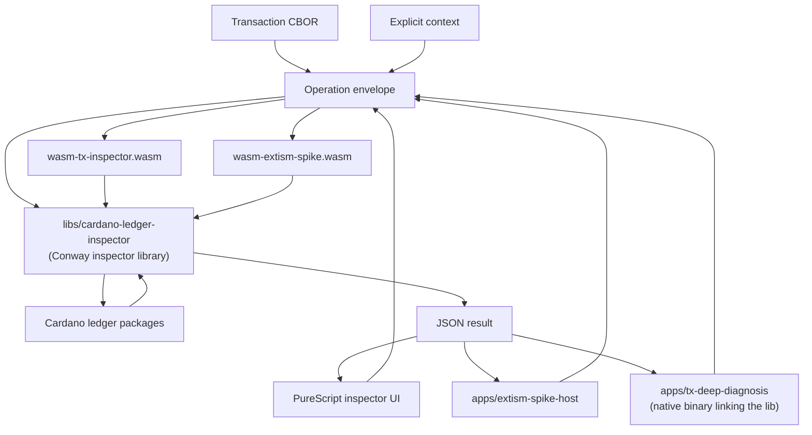
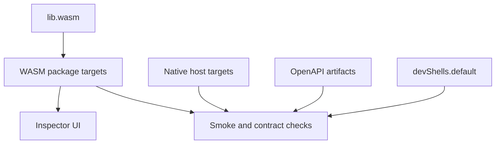

# Architecture

The project packages Cardano ledger operations as reproducible Nix outputs.
The browser, WASI module, Extism spike, OpenAPI bundle, and smoke checks are
separate artifacts, but they share one ledger operation implementation.

The same `cardano-ledger-inspector` Haskell library is compiled three ways:
to wasm32-wasi (loaded by the browser), to wasm32-wasi as an Extism plugin,
and natively (linked into `apps/tx-deep-diagnosis`). Every consumer talks to
the same dispatcher and gets the same JSON contract.

## Layers

### Browser Layer

`docs/inspector/` contains the PureScript workbench. It is responsible for
fetching or accepting transaction CBOR, managing local browser state, invoking
the WASI module, and presenting operation results. The browser bundle embeds
the built `wasm-tx-inspector.wasm` artifact at build time.

### Inspector library

`libs/cardano-ledger-inspector/` is the canonical Haskell library. Modules
under `src/Conway/Inspector*` decode Conway transaction CBOR via the upstream
`cardano-ledger-conway` packages, run `applyTx`, evaluate Plutus scripts, and
return typed JSON results behind a single dispatcher entry
(`runLedgerOperationInput`). Three executables compile this library to
different targets, all from the same source.

### WASI Layer

The library's `app/Main.hs` is a 34-line WASI reactor that reads one JSON
envelope (or raw transaction hex) from stdin and writes one JSON response. Its wasm build, configured
by `libs/cardano-ledger-inspector/cabal-wasm.project`, produces
`wasm-tx-inspector.wasm`. The browser loads it with `@bjorn3/browser_wasi_shim`.

### Extism Layer

`apps/wasm-extism-spike/` packages the same inspector library as an Extism PDK
plugin. The exported functions are operation entry points such as
`tx_identify`, `tx_validate`, and `tx_evaluate_scripts`; each one accepts the
same JSON envelope as the WASI reactor and delegates to the shared inspector
dispatcher.

`apps/extism-spike-host/` is a native Haskell host used for conformance checks.
It links the prebuilt `libextism` runtime from `nix/host/libextism.nix` because
the current nixpkgs `extism-cli` path is blocked by wazero tail-call support.

### Native CLI Layer

`apps/tx-deep-diagnosis/` is a native Haskell host that links the inspector
library directly (no wasm in the loop). It calls
`Conway.Inspector.runLedgerOperationInput` for `tx.intent` and `tx.validate`,
adds Blockfrost producer-tx resolution, and labels script hashes against
vendored CIP-57 blueprints + the Amaru deployment journal under
`docs/inspector/protocols/`. Built via `pkgs.haskell-nix.cabalProject'` with
CHaP and the same GHC 9.8.4 setup the cardano-mpfs-offchain project uses.

### Ledger Layer

`cardano-ledger-conway`, `cardano-ledger-api`, `plutus-ledger-api` and friends
provide all transaction-decoding and validation logic. Both the wasm and native
builds of the inspector library link the same versions (pinned via CHaP). This
keeps every consumer aligned with ledger behaviour instead of maintaining a
second transaction model.

## State Model

Host applications own state. A browser or CLI can manage many transactions,
select one, and pass its CBOR to a WASI operation. The WASI operation itself
receives explicit inputs and returns explicit outputs.

This keeps operations reproducible while still allowing richer host workflows,
such as transaction collections, comparison views, or future editing and
balancing tools.

## Flake Output Design

The flake is intentionally split into reusable library code, build artifacts,
checks, and a development shell. Outputs are exposed for `x86_64-linux` and
`aarch64-darwin`; CI currently exercises the Linux outputs.

### Library Outputs

| Output | Purpose |
| --- | --- |
| `lib.wasm.cabalWasmProjectFragment` | Reusable Cabal project stanza for Cardano ledger WASM builds. |
| `lib.wasm.mkCardanoLedgerWasm` | Helper that builds a Haskell package set with `wasm32-wasi-ghc`, CHaP, source-repository-package forks, optional WASI C libraries, and a locked dependency cache. |
| `lib.wasm.forks` | The fork metadata used by the WASM Cabal project fragment. |

These outputs are system-agnostic. Package and check outputs pass the
per-system `pkgs`, `ghc-wasm-meta`, CHaP source, and target source tree into
`mkCardanoLedgerWasm`.

### Package Outputs

| Output | Contents | Role |
| --- | --- | --- |
| `packages.<system>.wasm-smoke` | `wasm-smoke.wasm` | Minimal CBOR-only WASM build proving the GHC WASM toolchain and dependency-cache pattern. |
| `packages.<system>.wasm-ledger-smoke` | `wasm-ledger-smoke.wasm` | Full ledger closure smoke target, including WASM-built crypto C libraries. |
| `packages.<system>.wasm-tx-inspector` | `wasm-tx-inspector.wasm` | Main WASI functional layer module. It reads one JSON envelope from stdin and writes one JSON response. |
| `packages.<system>.wasm-extism-spike` | `wasm-extism-spike.wasm` | Extism PDK plugin exposing the same ledger operation contract through named exports. |
| `packages.<system>.extism-spike-host` | Native executable `extism-spike-host` | Wasmtime-backed host used to call the Extism plugin in checks. |
| `packages.<system>.tx-deep-diagnosis` | Native executable `tx-deep-diagnosis` | Native CLI that links the inspector library, resolves inputs via Blockfrost, and labels script hashes against vendored blueprints + the Amaru journal. Produces a layered diagnosis report. |
| `packages.<system>.tx-deep-diagnosis-render-snapshot` | Native executable `tx-deep-diagnosis-render-snapshot` | Golden-file snapshot harness for the explain-artifact renderers; `--write` regenerates the expected files under `apps/tx-deep-diagnosis/test/golden/`. |
| `packages.<system>.libextism` | Native `libextism` library and headers | Prebuilt Extism runtime used by the native host package. |
| `packages.<system>.tx-inspector-ui` | `index.html`, `index.js` | Browser workbench bundle. The WASI inspector bytes are embedded during the PureScript/esbuild build. |
| `packages.<system>.ledger-functional-openapi-generated` | Generated `cardano-ledger-functional.openapi.json` | Deterministic OpenAPI JSON generated from the Nix source definition. |
| `packages.<system>.ledger-functional-openapi` | OpenAPI JSON plus referenced schema JSON files | Publishable API bundle for docs and CI artifacts. |
| `packages.<system>.ledger-functional-swagger` | Alias of `ledger-functional-openapi` | Compatibility output for consumers that still look for the Swagger name. |
| `packages.<system>.default` | Alias of `tx-inspector-ui` | Default package for `nix build`. |

The WASM package targets use fixed-output dependency derivations. When Cabal
inputs, CHaP pins, source-repository-package forks, or package lists change,
the target's `dependenciesHash` is recomputed deliberately instead of allowing
implicit network access during the final build.

### Check Outputs

| Output | What it verifies |
| --- | --- |
| `checks.<system>.ledger-functional-openapi-check` | Regenerates OpenAPI JSON from `nix/ledger-functional-openapi.nix` and diffs it against the committed file under `specs/001-ledger-functional-layer/openapi/`. |
| `checks.<system>.ledger-functional-swagger-check` | Alias of the OpenAPI check for the Swagger compatibility name. |
| `checks.<system>.tx-identify-smoke` | Runs `tx.identify` through `wasm-tx-inspector.wasm` and asserts stable identity, size, fee, and witness-count fields. |
| `checks.<system>.tx-witness-plan-smoke` | Runs `tx.witness.plan` without context and asserts witness, script, datum, redeemer, and warning shapes. |
| `checks.<system>.tx-witness-attach-smoke` | Runs `tx.witness.attach`, asserts inserted vs replaced behavior, preserves transaction identity, and checks rejected missing-witness diagnostics. |
| `checks.<system>.tx-intent-smoke` | Runs `tx.intent` against a complete producer-context fixture and verifies signer-perspective value accounting. |
| `checks.<system>.tx-input-context-smoke` | Derives synthetic producer transaction context from inspection output and verifies resolved input reporting. |
| `checks.<system>.tx-validate-smoke` | Covers missing context, unsupported provider-style UTxO JSON, complete valid context, deterministic validation output, and invalid supplied network context. |
| `checks.<system>.tx-evaluate-scripts-smoke` | Covers missing context, rejected provider-style UTxO JSON, complete script evaluation, deterministic output, budgeted units, and evaluated units. |
| `checks.<system>.tx-extism-spike-smoke` | Calls the Extism plugin through `extism-spike-host` and checks that Extism responses for shared envelopes match the WASI reactor byte-for-byte. |
| `checks.<system>.tx-explain-render-smoke` | Runs the render-snapshot harness in compare mode against the committed golden explain artifacts. |
| `checks.<system>.tx-deep-diagnosis-emit-explain-smoke` | Runs the native CLI with `--emit-explain` end-to-end and verifies the emitted artifact set. |

The smoke checks are intentionally fixture-driven. They do not fetch provider
state or hide network lookups inside the ledger layer; all transaction CBOR and
context evidence comes from committed fixtures or from synthetic values created
inside the check.

### Development Shell

`devShells.<system>.default` provides the tools used by local development and
CI recipes:

| Tool | Use |
| --- | --- |
| `just` | Task runner for the documented local workflow. |
| `wasmtime` | Runs WASI artifacts in smoke checks and manual tests. |
| `jq` | Builds request fixtures and asserts JSON response contracts. |
| `curl` | Manual API/provider probing when needed. |
| `playwright-test` | Browser regression tests for the inspector UI. |
| `nixfmt-rfc-style` | Nix formatting. |
| `fourmolu` | Haskell formatting. |
| `mkdocs`, `mkdocs-material`, `pymdown-extensions` | Documentation site build. |
| `purs`, `spago-unstable`, `esbuild`, `nodejs_20` | PureScript UI build. |

The shell also sets `PLAYWRIGHT_BROWSERS_PATH` and
`PLAYWRIGHT_SKIP_BROWSER_DOWNLOAD` so Playwright uses the Nix-provided browser
bundle instead of downloading one.

## CI and Artifact Flow

The flake outputs define the CI surface:

1. Build the WASI module and browser package from pinned inputs.
2. Regenerate and compare the OpenAPI output against the committed spec.
3. Run fixture-based WASI and Extism smoke checks.
4. Upload downloadable artifacts for the WASI bundle, browser bundle, and API
   bundle.
5. Publish the MkDocs site, with the inspector UI mounted under `/inspector/`
   and OpenAPI assets mounted under `/openapi/`.

This keeps the repository docs, browser preview, downloadable artifacts, and
contract checks tied to the same Nix output graph.
