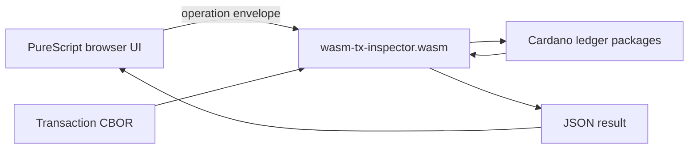

# Architecture

The project splits the browser experience from ledger semantics.

## Layers

### Browser Layer

`docs/inspector/` contains the PureScript workbench. It is responsible for
fetching or accepting transaction CBOR, managing local browser state, invoking
the WASI module, and presenting operation results.

### WASI Layer

`nix/wasm/tx-inspector/` contains the Haskell executable compiled to
`wasm32-wasi`. It reads operation requests from stdin and emits JSON. The
browser loads the executable with `@bjorn3/browser_wasi_shim`.

### Ledger Layer

The Haskell executable depends on Cardano ledger packages and uses those APIs
for transaction decoding and operations. This keeps the browser tool aligned
with ledger behavior instead of maintaining a second transaction model.

## State Model

Host applications own state. A browser or CLI can manage many transactions,
select one, and pass its CBOR to a WASI operation. The WASI operation itself
receives explicit inputs and returns explicit outputs.

This keeps operations reproducible while still allowing richer host workflows,
such as transaction collections, comparison views, or future editing and
balancing tools.
